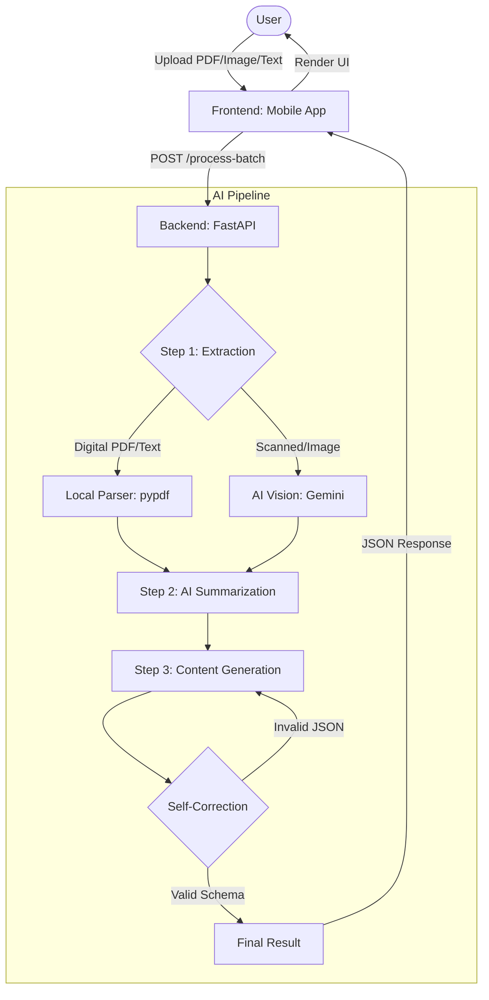

# EduAI Ecosystem

EduAI Ecosystem is a comprehensive educational platform designed to streamline knowledge extraction and document processing. By integrating an AI-powered backend with a cross-platform mobile frontend, it enables users to generate structured study materials, such as quizzes and notes, directly from their learning documents (PDFs, images, or raw text). The system leverages advanced LLMs to transform unstructured data into actionable educational content.

## Project Structure

- **`backend/`**: A FastAPI-based Python server that orchestrates the AI pipeline. It handles document processing, text extraction, and content generation using the Gemini API.
- **`frontend/`**: A React Native mobile application built with Expo, providing a seamless interface for capturing documents and interacting with generated study materials.

## Architecture

The ecosystem follows a classic client-server architecture. The **frontend** (mobile app) serves as the capture and consumption layer, communicating with the **backend** via a RESTful API. 

### AI Workflow



When a user uploads a document, the backend initiates the multi-stage pipeline shown above to ensure high logical accuracy and data validity.

## How to Run

### Backend

1. Navigate to the `backend/` directory:
   ```bash
   cd backend
   ```
2. (Optional) Create and activate a virtual environment:
   ```bash
   python -m venv env
   source env/bin/activate
   ```
3. Install dependencies:
   ```bash
   pip install -r requirements.txt
   ```
4. Start the server:
   ```bash
   PORT=8080 bash ./start.sh
   ```
   The API will be available at `http://localhost:8080`.

### Frontend

1. Navigate to the `frontend/` directory:
   ```bash
   cd frontend
   ```
2. Install dependencies:
   ```bash
   npm install
   ```
3. Start the Expo development server:
   ```bash
   npx expo start
   ```
   You can then run the app on a physical device via the Expo Go app or use an emulator (Android/iOS).
